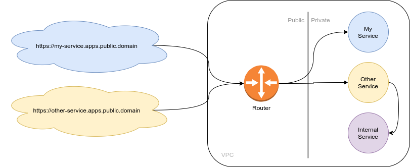
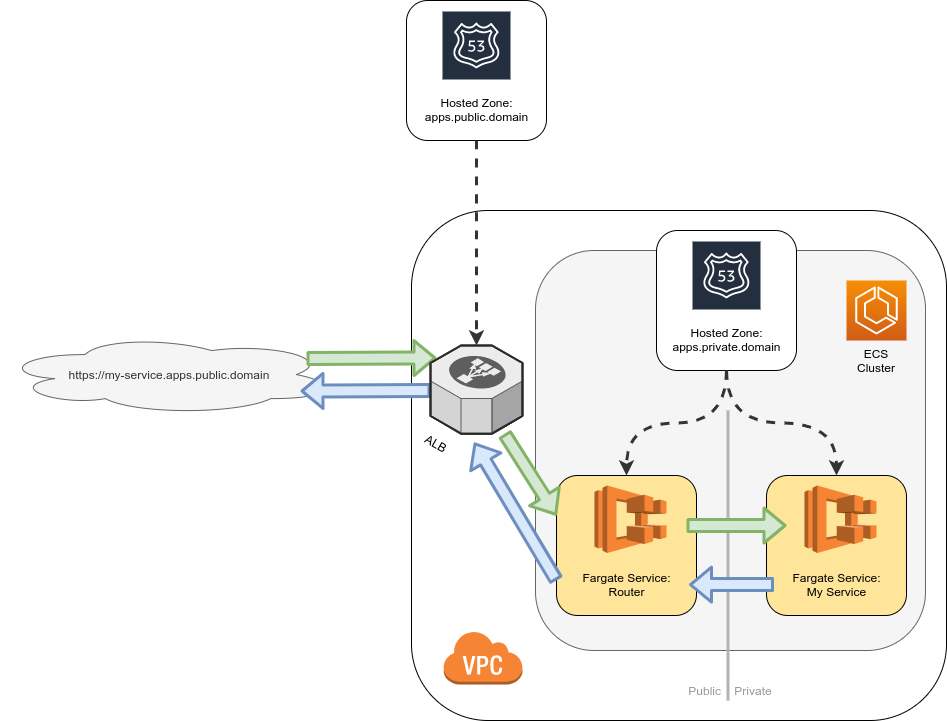

# AWS CDK L3 Construct: Application Runtime

This package implements an opinionated (web) application runtime in AWS CDK and is supplemental for a [Blog entry](https://ulrichkautz.com/posts/2021-06-09_application-plaform-as-code/) on the topic of implementing Application Platform as a composed, logical infrastructure construct.



Provided are multiple AWS CDK Level 3 constructs:

- **Cluster**: Encapsulates an web application runtime cluster, aka an environment to run micro services. The implementation is based on ECS with Fargate. A shared routing model is implemented, in which one ALB is setup, which routes everyting to a Traefik instance, that then routes the incoming HTTP(S) requests to the respective public service. The cluster uses private and public network separation, allowing services to be exposed only internally (to other services) or publicly with an address composed the service name and a configurable public domain (`http(s)://service-name.public.domain/`)
- Applicationss:
  - **All**: Based on docker image, which can be build from local directory and to which CPU and memory resources can be assigned. Implements both `IGrantable` and `IConnectable`, so access (via IAM) to other AWS resources and network access to other AWS resources (via security groups) can an be easily manged.
  - **Service**: Is a continuously running application, that can be exposed publicly. Resource requirements can contain scaling conditions based on CPU or memory consumption (or fixed amount).
  - **Scheduled Task**: Is an application that is executed at scheduled times. Resource requirements can contain concurrency settings.

The resulting AWS infrastructure looks roughly like this (leaving out multiple availability zones and glue like IAM, sec groups etc):



## Purpose & State

The purpose of this module is for me to explore the idea outlined in the Blog entry. In short: a library that provides AWS CDK L3 constructs implementing components that allow to run and maintain an application platform from AWS CDK code alone.

This project is to be considered **experimental**. This is a Proof-of-concept. _Do not use it in production_, for I don't. This is one of the reasons why I decided not to publish to the official NPM registry, but to use [Github packages](https://github.com/features/packages) instead.

## Usage

Learn how to use an _Github Packages_ hosted NPM packages [here](https://docs.github.com/en/packages/guides/configuring-npm-for-use-with-github-packages#installing-a-package), then you can:

```sh
npm install @ukautz/aws-cdk-app-runtime
```

### Minimal Application Runtime

The following creates the a VPC, an ECS cluster within, two hosted zones (one is a service discovery cloudmap, if you need to know) and a router service that runs Traefik - as well as all the boilerplate and glue resources.

```typescript
import * as cdk from '@aws-cdk/core';
import * as route53 from '@aws-cdk/aws-route53';
import * as appruntime from '@ukautz/aws-cdk-app-runtime';
import * as path from 'path';

export class MinimalStack extends cdk.Stack {
  constructor(scope: Construct, id: string, props?: cdk.StackProps) {
    super(scope, id, props);

    // create a cluster, in which the services will run
    const cluster = new appruntime.Cluster(this, 'Cluster', {
      // will be the hosted zone, in which `<any-app-name>.public.domain` will be routed to load balancer as wildcard record
      publicDomain: 'public.domain',

      // the domain used to address other services privately (`<app-name>.private.domain`)
      privateDomain: 'private.domain',
    });

    // create a service in the cluster
    new appruntime.Service(this, 'WebApp', {
      cluster,

      // assuming Dockerfile is two directories above where this file lives
      image: 'path:' + path.join(__dirname, '..', '..'),

      // name of the service, so it will be available at https://my-app.public.domain
      name: 'my-app',

      // make sure it's exposed to the interwebs
      public: true,
    });
  }
}
```

### In detail

Please check out the [`example`](example/) folder for a more complete example.
