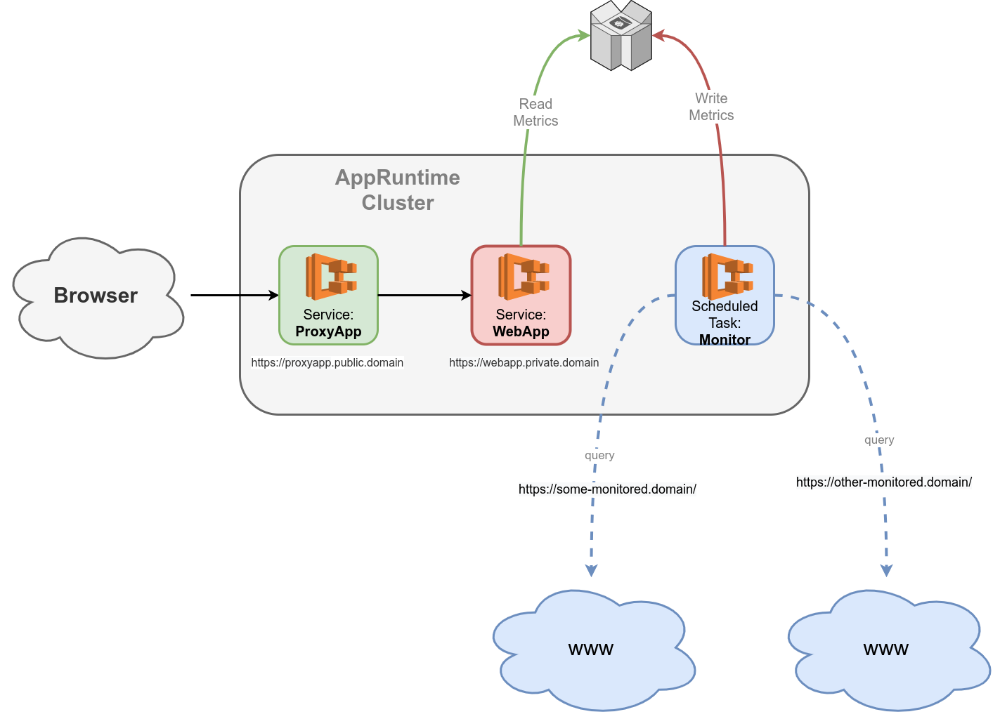

# Example: Uptime Monitor in App Runtime Cluster

This example usage of the AppRuntime library creates a new Cluster and then implements a simple monitoring application, that consists of:

- A scheduled task, that queries a set of URLs periodically and persists the performance in a DynamoDB database
- A web service, that renders a graphs from the metrics of the queried URLs and provides an API to query the metrics in the database. The service is _not_ exposed publicly.
- Another web service, that _is_ exposed publicly, that proxies all incoming request to the web service, but only so that hte rendered graphs, but not the API is public

## Requirements

- An AWS account to play in
- Money to pay the deployed infrastructure (IT WILL COST MONEY, I DUNNO HOW MUCH)
- A hosted zone, that is active, for a domain that is save to play with

### How to

[See in stack](stack/)
